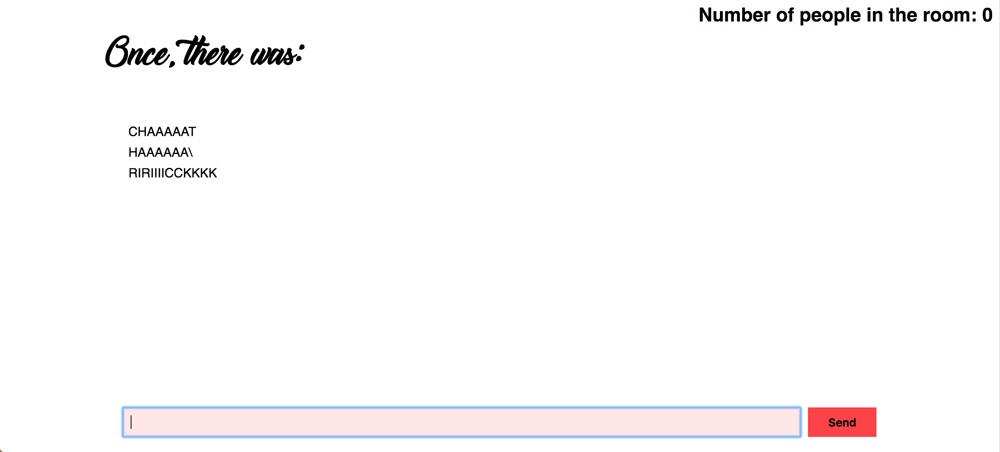

# Real Time Chat

This project is built with `socket.io` and is used for basic communications via a chat.

<p align="center">
  
</p>
- **[Installing](#installing)**  
- **[About this project](#about-this-project)**  

## Installing
install
```javascript
npm install
```
run
```javascript
nodemon app.js
```

## About this project
This project features a chat for multiple people.
You can send messages to each other in **REAL TIME!!!!**

_git money_
